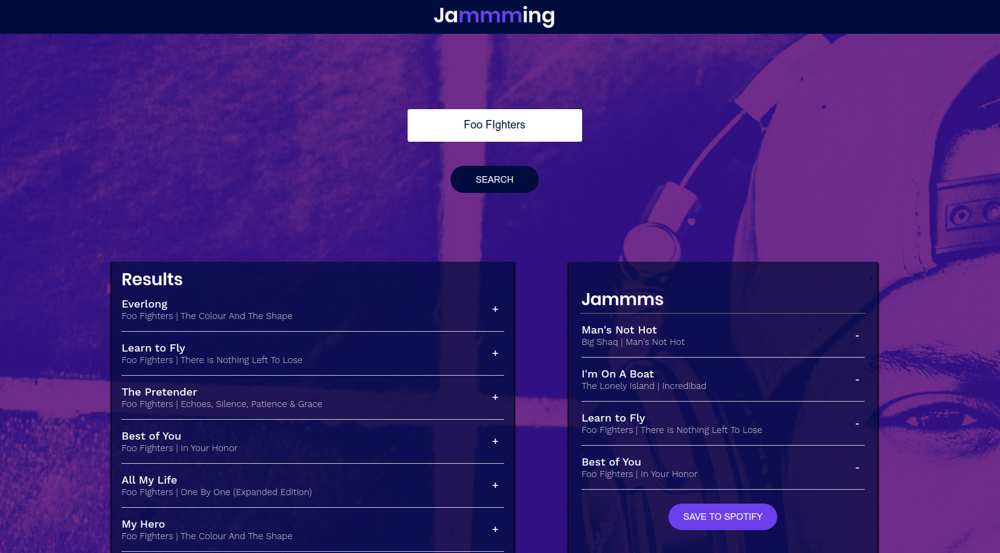

# Jammming

A Codecademy project to create a playlist creator for Spotify

# Deployed Build

[Space Jammming](http://space_jammming.surge.sh/)

## Images

## Future Features

-[] Include preview samples for each track

-[] Only display songs not currently present in the playlist in the search results

-[] Add a loading screen while playlist is saving

-[] Update the access token logic to expire at exactly the right time, instead of setting expiration from when the user initiates their next search

-[] After user redirect on login, restoring the search term from before the redirect

-[] Ensure playlist information doesn’t get cleared if a user has to refresh their access token

## Built With

- [ReactJS](https://reactjs.org/) - A JavaScript Framework

## Authors

- [Declan O'Donnell](https://github.com/Dexyod) - Design / Development
